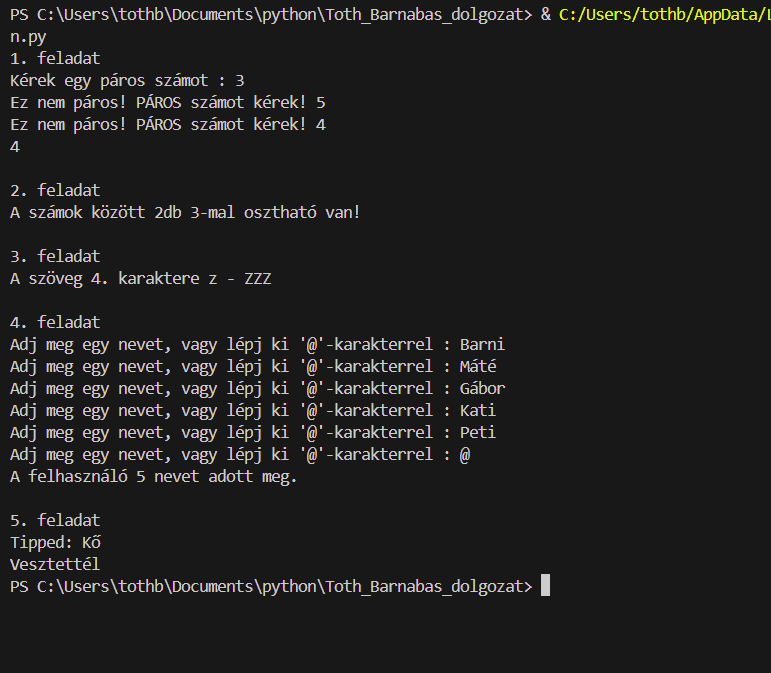

##  1. feladat

Kérj be 1 páros számot a felhasználótól. ***(1 pont)***
Amennyiben nem páros számot ad meg a felhasználó, akkor kérd be újra a számot, addig, amíg páros számot nem ad meg!  ***(1 pont)***	

## 2. feladat

Írass ki a konzolra 13 db  [10, 150] zárt intervallumba eső véletlen számot. Hány 3-mal osztható van közöttük? A kiírás formátuma: „A számok között X db 3-mal osztható van!”

## 3. feladat

Írj eljárást, mely paraméterként kap egy ***text*** szöveget, és egy ***N*** számot. 
Amennyiben a szöveg rövidebb, mint a megadott N szám, akkor írjuk ki „Nincs N. karakter!”
Ha hosszabb, akkor a ***text*** szövegnek az N. karakterét írjuk ki csupa nagybetűvel 3-szor! 
pl: 
    feladat3(„Ez az én dumám”,4)
    a 4. karakter „z”, 
    nagybetűvé alakítva: Z -  ezt írjuk ki 3-szor
    A kiírás formátuma: A szöveg 4. karaktere z -  ZZZ

## 4. feladat

Írj metódust, mely neveket kér a felhasználótól, amíg a @ jelet nem kapja.
Hány nevet adott meg a felhasználó? 

A kiírás formája: „A felhasználó 12 nevet adott meg.”

## 5. feladat

Szimuláljuk a kő-papír-olló játékot. 
Írj eljárást, amiben: 
A felhasználótól bekérjük a tippjét, ami kő/papír/olló lehet. Alakítsd át csupa kisbetűssé a szöveget, majd tárold el a felhasznalo_tippje változóban. 
Ezután a gép generál egy egész számot [1, 3] között.  1- kő, 2- papír – 3 olló. Tárold el a gep_tippje változóban
Ezután írd ki, hogy ki nyert!
    Ha a két szó ugyanaz, írja ki, hogy Döntetlen. 
    Egyéb esetben azt írja ki, aki győzött!

***Futási eredmények***
